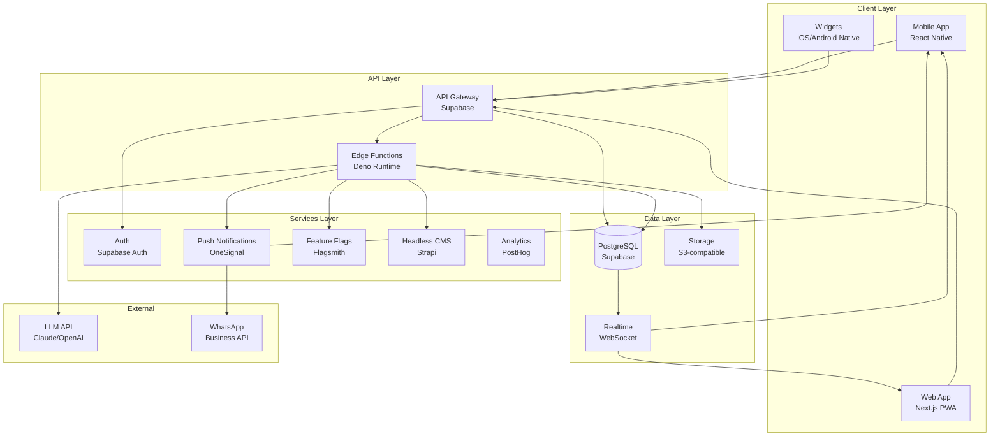
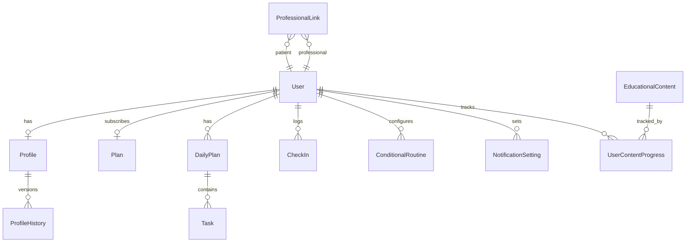
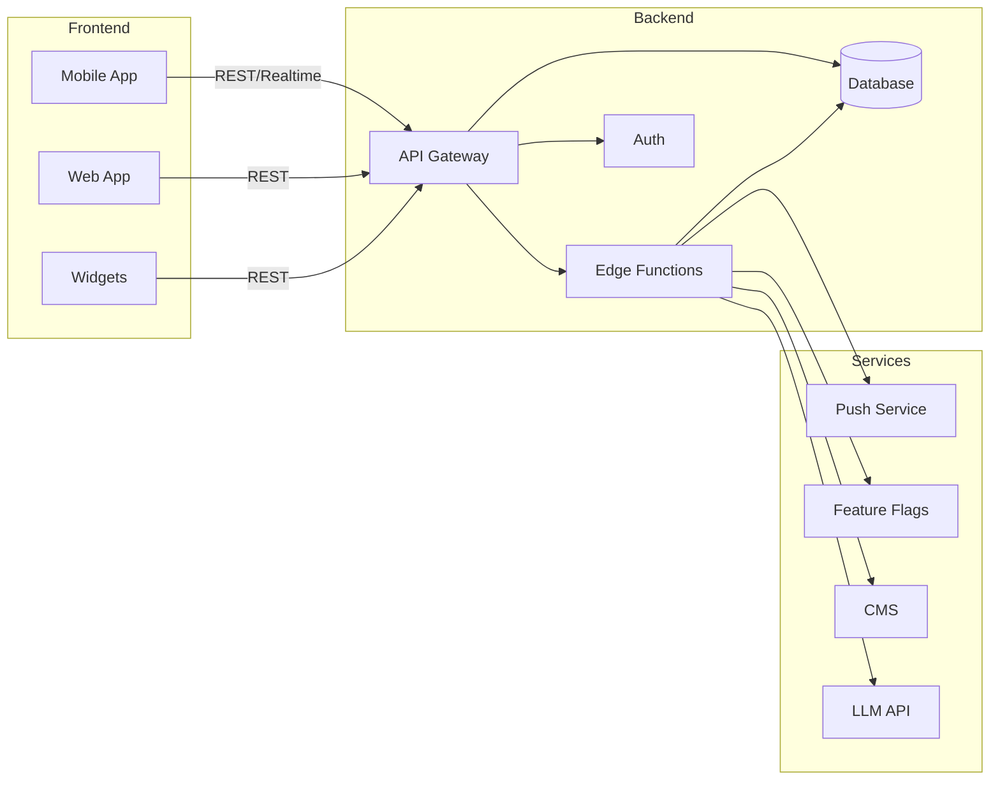
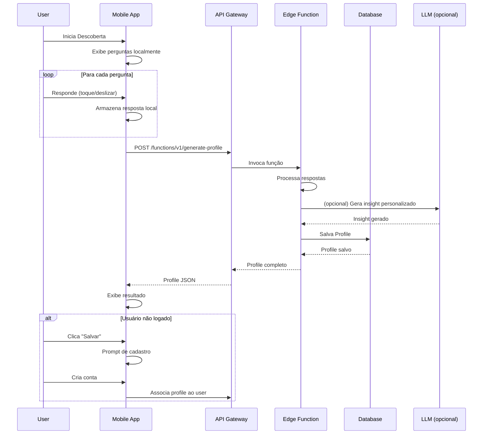
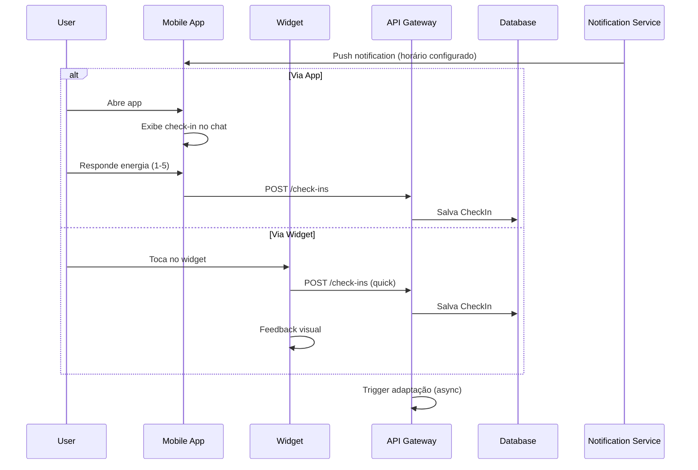
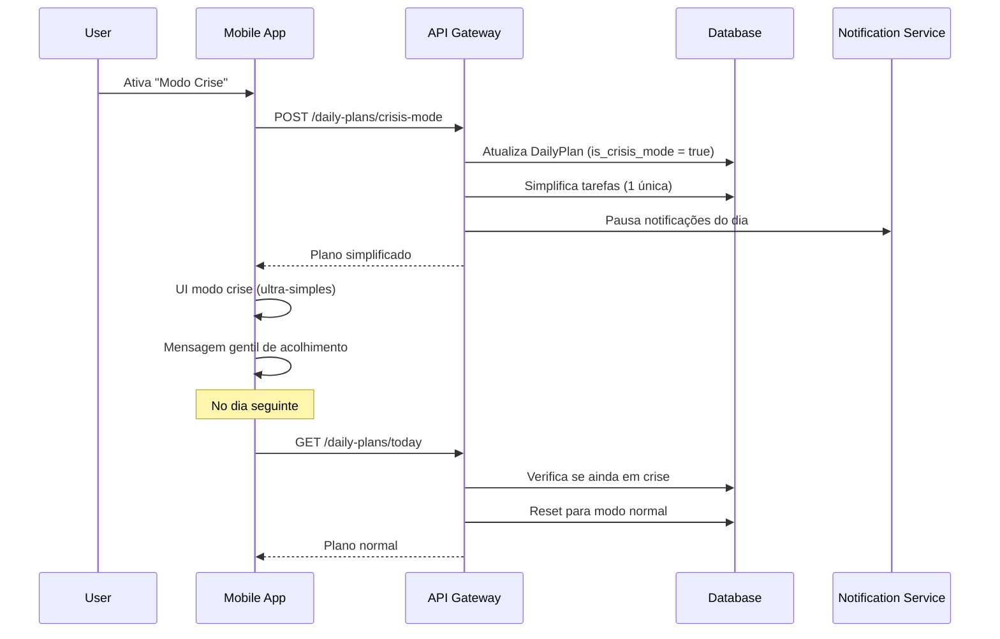
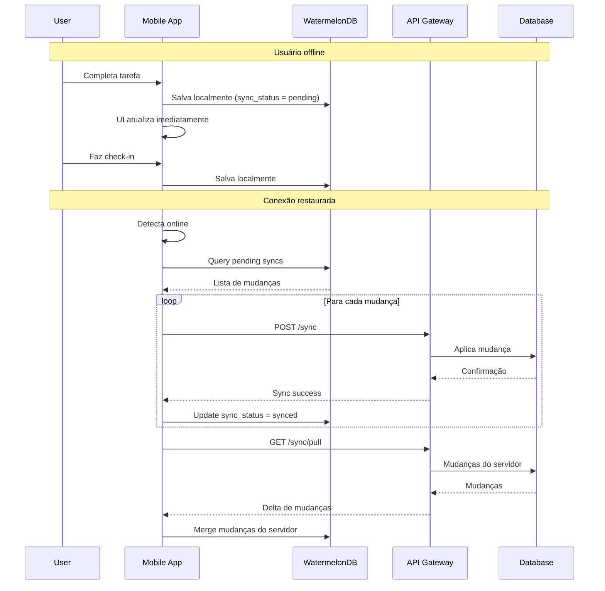

# NCIAFlux Architecture Document

**Versão:** 1.1
**Data:** 25 de Janeiro de 2026
**Status:** Draft

---

## 1. Introduction

Este documento descreve a arquitetura técnica do NCIAFlux (NeuroFluxo), servindo como blueprint para desenvolvimento guiado por IA. A arquitetura foi projetada para suportar os três pilares do produto: **Autoconhecimento**, **Adaptação Constante** e **Sem Pressão**.

**Relação com Frontend Architecture:**
A especificação de UI/UX está documentada em `docs/front-end-spec.md` e deve ser usada em conjunto com este documento para decisões de implementação de interface.

### 1.1 Starter Template

**N/A** - Projeto greenfield sem template base. A estrutura será construída do zero seguindo as melhores práticas para o stack escolhido.

### 1.2 Change Log

| Data | Versão | Descrição | Autor |
|------|--------|-----------|-------|
| 2026-01-23 | 1.0 | Criação inicial | Architect (BMad) |
| 2026-01-25 | 1.1 | Roadmap atualizado: v1.5 Times, v1.6 PWA, v1.7 Notificacoes, v2.0 IA, v2.5 Testes, v3.0 Nativo. Planos: Free, Team, Premium, Empresarial | Architect (Claude) |
| 2026-01-25 | 1.2 | Adicionado v1.3 Chat Input (OpenRouter) e v1.8 Voice Output. Arquitetura do chat com IA | Architect (Claude) |

---

## 2. High Level Architecture

### 2.1 Technical Summary

O NCIAFlux adota uma **arquitetura serverless** com **monorepo** para maximizar agilidade e minimizar custos operacionais. O sistema é composto por um app mobile React Native (iOS/Android), API serverless em Node.js/TypeScript, banco de dados PostgreSQL gerenciado, e CMS headless para conteúdo dinâmico. A arquitetura prioriza **offline-first** para garantir que usuários com TDAH não percam dados por problemas de conexão, e utiliza **feature flags** extensivamente para gestão de planos sem deploy.

### 2.2 High Level Overview

1. **Estilo Arquitetural**: Serverless com componentes gerenciados (BaaS - Backend as a Service)
2. **Estrutura de Repositório**: Monorepo (conforme PRD seção 4.1)
3. **Arquitetura de Serviços**: API Gateway + Lambda Functions organizadas por domínio
4. **Fluxo Principal de Dados**:
   - Mobile App ↔ API Gateway ↔ Lambda Functions ↔ Database
   - Dados offline sincronizam via queue quando online
   - Push notifications via serviço gerenciado
5. **Decisões Arquiteturais Chave**:
   - React Native (não Flutter) para aproveitar ecossistema TypeScript
   - Supabase como plataforma principal (Auth, Database, Storage, Realtime)
   - WatermelonDB para offline-first no mobile
   - Edge Functions para lógica serverless

### 2.3 High Level Project Diagram



### 2.4 Architectural and Design Patterns

- **Serverless Architecture:** Edge Functions (Supabase/Deno) para compute - _Rationale:_ Alinha com requisito de custo otimizado e escalabilidade automática, zero cold-start com Deno
- **Repository Pattern:** Abstração de acesso a dados via services - _Rationale:_ Facilita testes e futura migração de banco se necessário
- **Offline-First Pattern:** WatermelonDB com sync queue - _Rationale:_ Crítico para usuários TDAH que podem ter interrupções frequentes
- **Feature Flag Pattern:** Flagsmith para controle de features por plano - _Rationale:_ Atende NFR18/NFR19 de gestão sem deploy
- **Event-Driven (parcial):** Realtime subscriptions para sync - _Rationale:_ Permite updates em tempo real sem polling
- **CQRS Light:** Separação de queries (read replicas) e commands - _Rationale:_ Otimiza leitura do dashboard que é acessado frequentemente

---

## 3. Tech Stack

### 3.1 Cloud Infrastructure

- **Provider:** Supabase (PostgreSQL hosted) + Vercel (Web) + AWS (complementar)
- **Key Services:**
  - Supabase: Auth, Database, Storage, Realtime, Edge Functions
  - Vercel: Next.js hosting, Edge Network
  - AWS: S3 (backups), CloudWatch (monitoring)
  - OneSignal: Push Notifications
- **Deployment Regions:** Primary: São Paulo (sa-east-1), Secondary: US East (fallback)

### 3.2 Technology Stack Table

| Category | Technology | Version | Purpose | Rationale |
|----------|------------|---------|---------|-----------|
| **Language** | TypeScript | 5.3.3 | Primary language (full-stack) | Type safety, shared types entre mobile/api, ecosystem |
| **Runtime (API)** | Deno | 1.40.x | Edge Functions runtime | Zero cold-start, built-in TypeScript, secure by default |
| **Runtime (Mobile)** | React Native | 0.73.x | Mobile framework | Compartilha código TypeScript, hot reload, comunidade madura |
| **Runtime (Web)** | Next.js | 14.1.x | Web/PWA framework | SSR, App Router, excellent DX, Vercel integration |
| **Database** | PostgreSQL | 15.x | Primary database | ACID, JSON support, Row-Level Security, Supabase native |
| **Local DB** | WatermelonDB | 0.27.x | Offline-first mobile storage | Lazy loading, sync primitives, React Native native |
| **Auth** | Supabase Auth | latest | Authentication | OAuth, MFA ready, Row-Level Security integration |
| **Storage** | Supabase Storage | latest | File storage (avatars, exports) | S3-compatible, CDN, access policies |
| **Push** | OneSignal | latest | Push notifications | Multi-platform, scheduling, segmentation, templates |
| **Feature Flags** | Flagsmith | 2.x | Feature management | Open-source, self-hostable, percentage rollouts |
| **CMS** | Strapi | 4.x | Headless CMS for educational content | Open-source, customizable, REST + GraphQL |
| **Analytics** | PostHog | latest | Product analytics | Privacy-focused, event tracking, feature flags backup |
| **Monitoring** | Sentry | latest | Error tracking | Real-time alerts, session replay, performance |
| **State (Mobile)** | Zustand | 4.x | Client state management | Lightweight, TypeScript native, simple API |
| **Forms** | React Hook Form | 7.x | Form handling | Performance, validation, minimal re-renders |
| **Validation** | Zod | 3.x | Schema validation | TypeScript inference, shared between client/server |
| **Testing** | Vitest | 1.x | Unit/Integration testing | Fast, ESM native, Jest compatible |
| **E2E Testing** | Detox | 20.x | Mobile E2E | React Native native, reliable |
| **CI/CD** | GitHub Actions | N/A | Automation | Native integration, marketplace |
| **Monorepo** | Turborepo | 1.x | Monorepo management | Fast builds, caching, Vercel native |

---

## 4. Data Models

### 4.1 User

**Purpose:** Representa um usuário do sistema com seu perfil de autenticação e configurações

**Key Attributes:**
- `id`: UUID - Identificador único
- `email`: string - Email do usuário
- `created_at`: timestamp - Data de criação
- `updated_at`: timestamp - Última atualização
- `plan_id`: UUID - Plano atual (FK)
- `onboarding_completed`: boolean - Se completou onboarding

**Relationships:**
- Has one Profile
- Has one Plan (subscription)
- Has many Tasks
- Has many CheckIns
- Has many NotificationSettings

### 4.2 Profile

**Purpose:** Perfil cognitivo gerado pela Descoberta, evolui com o uso

**Key Attributes:**
- `id`: UUID - Identificador único
- `user_id`: UUID - Usuário dono (FK)
- `summary`: text - Resumo do perfil (1-2 frases)
- `insight`: text - Insight central
- `suggestion`: text - Sugestão prática
- `energy_pattern`: jsonb - Padrão de energia por horário
- `execution_style`: enum - Estilo de execução (sequential, parallel, burst)
- `overload_threshold`: int - Nível de sobrecarga tolerado (1-10)
- `preferred_techniques`: text[] - Técnicas que funcionam
- `version`: int - Versão do perfil (para histórico)
- `created_from`: enum - Origem (discovery, adaptation, rediscovery)

**Relationships:**
- Belongs to User
- Has many ProfileHistory (versões anteriores)

### 4.3 Plan (Subscription)

**Purpose:** Plano de assinatura do usuário

**Key Attributes:**
- `id`: UUID - Identificador único
- `name`: enum - Nome do plano (free, team, premium, enterprise)
- `features`: jsonb - Features habilitadas
- `price_brl`: decimal - Preço em reais
- `billing_period`: enum - Período (monthly, yearly)

**Planos Disponíveis:**
| Plano | Versão | Storage | Features Principais |
|-------|--------|---------|---------------------|
| free | v1.2 | Local | Funcionalidades pessoais completas |
| team | v1.5 | Central + P2P | Times, chat equipe, descoberta central |
| premium | v2.0 | Cloud | Chat IA, voz, sync nuvem, terapeutas |
| enterprise | v3.0 | Cloud | Apps nativos, organizações, API pública |

**Relationships:**
- Has many Users

### 4.4 DailyPlan

**Purpose:** Plano diário gerado para o usuário

**Key Attributes:**
- `id`: UUID - Identificador único
- `user_id`: UUID - Usuário (FK)
- `date`: date - Data do plano
- `priority`: jsonb - Prioridade do dia {title, status, notes}
- `tasks`: jsonb[] - Tarefas leves (max 2)
- `focus_block`: jsonb - Bloco de foco {start_time, duration, technique}
- `suggested_techniques`: text[] - Técnicas sugeridas (max 3)
- `energy_level`: int - Energia relatada (1-5)
- `is_crisis_mode`: boolean - Se está em modo crise

**Relationships:**
- Belongs to User
- Has many Tasks

### 4.5 Task

**Purpose:** Tarefa individual dentro do plano

**Key Attributes:**
- `id`: UUID - Identificador único
- `daily_plan_id`: UUID - Plano do dia (FK)
- `title`: string - Título da tarefa
- `status`: enum - Status (pending, in_progress, completed, skipped)
- `priority_order`: int - Ordem de prioridade
- `started_at`: timestamp - Quando iniciou
- `completed_at`: timestamp - Quando completou
- `notes`: text - Notas opcionais

**Relationships:**
- Belongs to DailyPlan

### 4.6 CheckIn

**Purpose:** Registro de check-in do usuário (sinais leves)

**Key Attributes:**
- `id`: UUID - Identificador único
- `user_id`: UUID - Usuário (FK)
- `type`: enum - Tipo (energy, mood, task_feedback, daily_summary)
- `value`: jsonb - Valor do check-in (flexível por tipo)
- `source`: enum - Origem (chat, panel, widget, notification)
- `created_at`: timestamp - Quando foi feito

**Relationships:**
- Belongs to User

### 4.7 ConditionalRoutine

**Purpose:** Rotina condicional configurada pelo usuário (se/então)

**Key Attributes:**
- `id`: UUID - Identificador único
- `user_id`: UUID - Usuário (FK)
- `name`: string - Nome da rotina
- `condition`: jsonb - Condição {type, operator, value}
- `action`: jsonb - Ação {type, params}
- `is_active`: boolean - Se está ativa
- `times_triggered`: int - Vezes que foi ativada

**Relationships:**
- Belongs to User

### 4.8 NotificationSetting

**Purpose:** Configurações de notificação do usuário

**Key Attributes:**
- `id`: UUID - Identificador único
- `user_id`: UUID - Usuário (FK)
- `type`: enum - Tipo de notificação
- `is_enabled`: boolean - Se está habilitada
- `channel`: enum - Canal (push, whatsapp, email)
- `time`: time - Horário preferido
- `frequency`: enum - Frequência
- `custom_message`: text - Mensagem customizada (opcional)

**Relationships:**
- Belongs to User

### 4.9 EducationalContent

**Purpose:** Conteúdo educativo (pílulas) gerenciado via CMS

**Key Attributes:**
- `id`: UUID - Identificador único
- `title`: string - Título
- `content`: text - Conteúdo em markdown
- `category`: enum - Categoria
- `required_plan`: enum - Plano mínimo
- `is_published`: boolean - Se está publicado
- `order`: int - Ordem de exibição
- `read_time_minutes`: int - Tempo estimado de leitura

**Relationships:**
- Has many UserContentProgress

### 4.10 Entity Relationship Diagram



---

## 5. Components

### 5.1 Mobile App (React Native)

**Responsibility:** Interface principal do usuário, experiência offline-first, widgets nativos

**Key Interfaces:**
- REST API calls via Supabase client
- Realtime subscriptions para sync
- Local database (WatermelonDB) para offline
- Native modules para widgets

**Dependencies:** API Gateway, Push Notifications, Local Storage

**Technology Stack:** React Native 0.73, TypeScript, WatermelonDB, Zustand, React Navigation

### 5.2 Web App (Next.js)

**Responsibility:** Interface web responsiva/PWA, dashboard profissional, admin

**Key Interfaces:**
- REST/GraphQL API calls
- Server-side rendering
- Service Worker para PWA

**Dependencies:** API Gateway, Auth

**Technology Stack:** Next.js 14, TypeScript, Tailwind CSS, React Query

### 5.3 API Gateway (Supabase)

**Responsibility:** Roteamento de requests, autenticação, rate limiting, RLS

**Key Interfaces:**
- REST endpoints auto-gerados do schema
- Edge Functions para lógica custom
- Realtime channels para sync

**Dependencies:** PostgreSQL, Auth

**Technology Stack:** Supabase (PostgREST, GoTrue, Realtime)

### 5.4 Edge Functions

**Responsibility:** Lógica de negócio serverless, integrações externas

**Key Interfaces:**
- `/functions/v1/generate-profile` - Gera perfil da descoberta
- `/functions/v1/generate-daily-plan` - Gera plano diário
- `/functions/v1/process-adaptation` - Processa adaptação do perfil
- `/functions/v1/send-notification` - Envia notificações
- `/functions/v1/chat-response` - Resposta do chat (com LLM)

**Dependencies:** Database, External APIs (LLM, OneSignal)

**Technology Stack:** Deno, TypeScript, Zod

### 5.5 Database (PostgreSQL)

**Responsibility:** Persistência de dados, Row-Level Security, triggers

**Key Interfaces:**
- SQL via Supabase client
- RLS policies por user/plan
- Database triggers para automações

**Dependencies:** None (core)

**Technology Stack:** PostgreSQL 15, pg_cron, pg_vector (futuro)

### 5.6 Auth Service

**Responsibility:** Autenticação, gestão de sessões, OAuth

**Key Interfaces:**
- Sign up/in com email/senha
- OAuth (Google, Apple)
- Magic link
- Session management
- MFA (futuro)

**Dependencies:** Database

**Technology Stack:** Supabase Auth (GoTrue)

### 5.7 Notification Service

**Responsibility:** Envio de push notifications, scheduling, templates

**Key Interfaces:**
- Send immediate notification
- Schedule notification
- Cancel scheduled notification
- Segment targeting

**Dependencies:** OneSignal API, Database (settings)

**Technology Stack:** OneSignal SDK, Edge Functions

### 5.8 CMS (Strapi)

**Responsibility:** Gestão de conteúdo educativo, feature toggles de conteúdo

**Key Interfaces:**
- REST API para conteúdos
- Admin UI para gestão
- Webhooks para invalidação de cache

**Dependencies:** PostgreSQL (separado), Storage

**Technology Stack:** Strapi 4, PostgreSQL

### 5.9 Feature Flag Service

**Responsibility:** Gestão de features por plano, A/B testing, rollouts

**Key Interfaces:**
- Get flags for user
- Evaluate flag
- Track flag exposure

**Dependencies:** Flagsmith API

**Technology Stack:** Flagsmith (self-hosted ou cloud)

### 5.10 Component Diagram



---

## 6. External APIs

### 6.1 OneSignal API

- **Purpose:** Push notifications multi-plataforma
- **Documentation:** https://documentation.onesignal.com/
- **Base URL:** https://onesignal.com/api/v1
- **Authentication:** REST API Key
- **Rate Limits:** 1 request/second para creates, higher para reads

**Key Endpoints Used:**
- `POST /notifications` - Enviar notificação
- `DELETE /notifications/{id}` - Cancelar notificação agendada
- `POST /players` - Registrar dispositivo

**Integration Notes:** Usar SDK para mobile, REST para server-side

### 6.2 Claude API (Anthropic)

- **Purpose:** Chat inteligente, geração de insights
- **Documentation:** https://docs.anthropic.com/
- **Base URL:** https://api.anthropic.com/v1
- **Authentication:** API Key via header
- **Rate Limits:** Tier-based, começar com tier 1

**Key Endpoints Used:**
- `POST /messages` - Gerar resposta de chat

**Integration Notes:** Usar system prompt específico para tom gentil do NCIAFlux

### 6.3 Flagsmith API

- **Purpose:** Feature flags e configuração remota
- **Documentation:** https://docs.flagsmith.com/
- **Base URL:** https://edge.api.flagsmith.com/api/v1 (ou self-hosted)
- **Authentication:** Environment Key
- **Rate Limits:** 1M requests/month no plano gratuito

**Key Endpoints Used:**
- `GET /flags` - Obter flags para usuário
- `POST /identities` - Registrar identidade com traits

**Integration Notes:** Cachear flags localmente com TTL de 5 minutos

### 6.4 WhatsApp Business API (Futuro - Avançado)

- **Purpose:** Notificações via WhatsApp
- **Documentation:** https://developers.facebook.com/docs/whatsapp/
- **Authentication:** Access Token
- **Rate Limits:** Tier-based por quality rating

**Key Endpoints Used:**
- `POST /messages` - Enviar template message

**Integration Notes:** Requer aprovação de templates, usar apenas para notificações opt-in

---

## 7. Core Workflows

### 7.1 Fluxo de Descoberta



### 7.2 Fluxo de Check-in Diário



### 7.3 Fluxo de Modo Crise



### 7.4 Fluxo de Sincronização Offline



---

## 8. REST API Spec

```yaml
openapi: 3.0.0
info:
  title: NCIAFlux API
  version: 1.0.0
  description: API para o aplicativo NCIAFlux (NeuroFluxo)
servers:
  - url: https://api.nciaflux.com/v1
    description: Production
  - url: https://api-staging.nciaflux.com/v1
    description: Staging

paths:
  # Discovery
  /discovery/submit:
    post:
      summary: Submete respostas da descoberta
      tags: [Discovery]
      requestBody:
        required: true
        content:
          application/json:
            schema:
              type: object
              properties:
                answers:
                  type: array
                  items:
                    type: object
                    properties:
                      question_id: { type: string }
                      value: { type: string }
      responses:
        '200':
          description: Profile gerado
          content:
            application/json:
              schema:
                $ref: '#/components/schemas/Profile'

  # Daily Plans
  /daily-plans/today:
    get:
      summary: Obtém plano do dia atual
      tags: [Plans]
      security:
        - bearerAuth: []
      responses:
        '200':
          description: Plano do dia
          content:
            application/json:
              schema:
                $ref: '#/components/schemas/DailyPlan'

  /daily-plans/crisis-mode:
    post:
      summary: Ativa modo crise
      tags: [Plans]
      security:
        - bearerAuth: []
      responses:
        '200':
          description: Modo crise ativado
          content:
            application/json:
              schema:
                $ref: '#/components/schemas/DailyPlan'

  # Tasks
  /tasks/{id}/status:
    patch:
      summary: Atualiza status de tarefa
      tags: [Tasks]
      security:
        - bearerAuth: []
      parameters:
        - name: id
          in: path
          required: true
          schema: { type: string, format: uuid }
      requestBody:
        content:
          application/json:
            schema:
              type: object
              properties:
                status:
                  type: string
                  enum: [pending, in_progress, completed, skipped]
      responses:
        '200':
          description: Task atualizada

  # Check-ins
  /check-ins:
    post:
      summary: Registra check-in
      tags: [Check-ins]
      security:
        - bearerAuth: []
      requestBody:
        content:
          application/json:
            schema:
              type: object
              properties:
                type:
                  type: string
                  enum: [energy, mood, task_feedback, daily_summary]
                value:
                  type: object
                source:
                  type: string
                  enum: [chat, panel, widget, notification]
      responses:
        '201':
          description: Check-in registrado

  # Profile
  /profile:
    get:
      summary: Obtém perfil do usuário
      tags: [Profile]
      security:
        - bearerAuth: []
      responses:
        '200':
          description: Perfil do usuário
          content:
            application/json:
              schema:
                $ref: '#/components/schemas/Profile'

  # Notifications Settings
  /notification-settings:
    get:
      summary: Obtém configurações de notificação
      tags: [Notifications]
      security:
        - bearerAuth: []
      responses:
        '200':
          description: Configurações
    put:
      summary: Atualiza configurações
      tags: [Notifications]
      security:
        - bearerAuth: []
      requestBody:
        content:
          application/json:
            schema:
              type: array
              items:
                $ref: '#/components/schemas/NotificationSetting'
      responses:
        '200':
          description: Atualizado

  # Chat
  /chat/message:
    post:
      summary: Envia mensagem ao chat
      tags: [Chat]
      security:
        - bearerAuth: []
      requestBody:
        content:
          application/json:
            schema:
              type: object
              properties:
                message: { type: string }
                context: { type: object }
      responses:
        '200':
          description: Resposta do chat
          content:
            application/json:
              schema:
                type: object
                properties:
                  response: { type: string }
                  quick_replies:
                    type: array
                    items: { type: string }

  # Sync (Offline)
  /sync/push:
    post:
      summary: Push de mudanças offline
      tags: [Sync]
      security:
        - bearerAuth: []
      requestBody:
        content:
          application/json:
            schema:
              type: object
              properties:
                changes:
                  type: array
                  items:
                    type: object
                last_sync:
                  type: string
                  format: date-time
      responses:
        '200':
          description: Sync confirmado

  /sync/pull:
    get:
      summary: Pull de mudanças do servidor
      tags: [Sync]
      security:
        - bearerAuth: []
      parameters:
        - name: since
          in: query
          schema: { type: string, format: date-time }
      responses:
        '200':
          description: Mudanças do servidor

components:
  securitySchemes:
    bearerAuth:
      type: http
      scheme: bearer
      bearerFormat: JWT

  schemas:
    Profile:
      type: object
      properties:
        id: { type: string, format: uuid }
        summary: { type: string }
        insight: { type: string }
        suggestion: { type: string }
        energy_pattern: { type: object }
        execution_style: { type: string }
        preferred_techniques: { type: array, items: { type: string } }

    DailyPlan:
      type: object
      properties:
        id: { type: string, format: uuid }
        date: { type: string, format: date }
        priority: { type: object }
        tasks: { type: array }
        focus_block: { type: object }
        is_crisis_mode: { type: boolean }

    NotificationSetting:
      type: object
      properties:
        type: { type: string }
        is_enabled: { type: boolean }
        channel: { type: string }
        time: { type: string }
        frequency: { type: string }
```

---

## 9. Database Schema

```sql
-- Enable necessary extensions
CREATE EXTENSION IF NOT EXISTS "uuid-ossp";
CREATE EXTENSION IF NOT EXISTS "pg_trgm"; -- for text search

-- Enums
CREATE TYPE plan_type AS ENUM ('free', 'team', 'premium', 'enterprise');
CREATE TYPE task_status AS ENUM ('pending', 'in_progress', 'completed', 'skipped');
CREATE TYPE execution_style AS ENUM ('sequential', 'parallel', 'burst');
CREATE TYPE checkin_type AS ENUM ('energy', 'mood', 'task_feedback', 'daily_summary');
CREATE TYPE checkin_source AS ENUM ('chat', 'panel', 'widget', 'notification');
CREATE TYPE notification_channel AS ENUM ('push', 'whatsapp', 'email');
CREATE TYPE profile_origin AS ENUM ('discovery', 'adaptation', 'rediscovery');

-- Plans Table
CREATE TABLE plans (
    id UUID PRIMARY KEY DEFAULT uuid_generate_v4(),
    name plan_type UNIQUE NOT NULL,
    features JSONB NOT NULL DEFAULT '{}',
    price_brl DECIMAL(10,2),
    billing_period TEXT,
    created_at TIMESTAMPTZ DEFAULT NOW()
);

-- Users Table (extends Supabase auth.users)
CREATE TABLE users (
    id UUID PRIMARY KEY REFERENCES auth.users(id) ON DELETE CASCADE,
    plan_id UUID REFERENCES plans(id) DEFAULT (SELECT id FROM plans WHERE name = 'free'),
    onboarding_completed BOOLEAN DEFAULT FALSE,
    created_at TIMESTAMPTZ DEFAULT NOW(),
    updated_at TIMESTAMPTZ DEFAULT NOW()
);

-- Profiles Table
CREATE TABLE profiles (
    id UUID PRIMARY KEY DEFAULT uuid_generate_v4(),
    user_id UUID REFERENCES users(id) ON DELETE CASCADE,
    summary TEXT,
    insight TEXT,
    suggestion TEXT,
    energy_pattern JSONB DEFAULT '{}',
    execution_style execution_style,
    overload_threshold INTEGER DEFAULT 5 CHECK (overload_threshold BETWEEN 1 AND 10),
    preferred_techniques TEXT[] DEFAULT '{}',
    version INTEGER DEFAULT 1,
    created_from profile_origin DEFAULT 'discovery',
    created_at TIMESTAMPTZ DEFAULT NOW(),
    updated_at TIMESTAMPTZ DEFAULT NOW()
);

-- Profile History (for versioning)
CREATE TABLE profile_history (
    id UUID PRIMARY KEY DEFAULT uuid_generate_v4(),
    profile_id UUID REFERENCES profiles(id) ON DELETE CASCADE,
    version INTEGER NOT NULL,
    data JSONB NOT NULL,
    created_at TIMESTAMPTZ DEFAULT NOW()
);

-- Daily Plans Table
CREATE TABLE daily_plans (
    id UUID PRIMARY KEY DEFAULT uuid_generate_v4(),
    user_id UUID REFERENCES users(id) ON DELETE CASCADE,
    date DATE NOT NULL,
    priority JSONB,
    focus_block JSONB,
    suggested_techniques TEXT[] DEFAULT '{}',
    energy_level INTEGER CHECK (energy_level BETWEEN 1 AND 5),
    is_crisis_mode BOOLEAN DEFAULT FALSE,
    created_at TIMESTAMPTZ DEFAULT NOW(),
    updated_at TIMESTAMPTZ DEFAULT NOW(),
    UNIQUE(user_id, date)
);

-- Tasks Table
CREATE TABLE tasks (
    id UUID PRIMARY KEY DEFAULT uuid_generate_v4(),
    daily_plan_id UUID REFERENCES daily_plans(id) ON DELETE CASCADE,
    title TEXT NOT NULL,
    status task_status DEFAULT 'pending',
    priority_order INTEGER DEFAULT 0,
    started_at TIMESTAMPTZ,
    completed_at TIMESTAMPTZ,
    notes TEXT,
    created_at TIMESTAMPTZ DEFAULT NOW(),
    updated_at TIMESTAMPTZ DEFAULT NOW()
);

-- Check-ins Table
CREATE TABLE check_ins (
    id UUID PRIMARY KEY DEFAULT uuid_generate_v4(),
    user_id UUID REFERENCES users(id) ON DELETE CASCADE,
    type checkin_type NOT NULL,
    value JSONB NOT NULL,
    source checkin_source,
    created_at TIMESTAMPTZ DEFAULT NOW()
);

-- Conditional Routines Table
CREATE TABLE conditional_routines (
    id UUID PRIMARY KEY DEFAULT uuid_generate_v4(),
    user_id UUID REFERENCES users(id) ON DELETE CASCADE,
    name TEXT NOT NULL,
    condition JSONB NOT NULL,
    action JSONB NOT NULL,
    is_active BOOLEAN DEFAULT TRUE,
    times_triggered INTEGER DEFAULT 0,
    created_at TIMESTAMPTZ DEFAULT NOW(),
    updated_at TIMESTAMPTZ DEFAULT NOW()
);

-- Notification Settings Table
CREATE TABLE notification_settings (
    id UUID PRIMARY KEY DEFAULT uuid_generate_v4(),
    user_id UUID REFERENCES users(id) ON DELETE CASCADE,
    type TEXT NOT NULL,
    is_enabled BOOLEAN DEFAULT TRUE,
    channel notification_channel DEFAULT 'push',
    preferred_time TIME,
    frequency TEXT,
    custom_message TEXT,
    created_at TIMESTAMPTZ DEFAULT NOW(),
    updated_at TIMESTAMPTZ DEFAULT NOW(),
    UNIQUE(user_id, type)
);

-- Chat Messages Table
CREATE TABLE chat_messages (
    id UUID PRIMARY KEY DEFAULT uuid_generate_v4(),
    user_id UUID REFERENCES users(id) ON DELETE CASCADE,
    role TEXT NOT NULL CHECK (role IN ('user', 'assistant')),
    content TEXT NOT NULL,
    metadata JSONB DEFAULT '{}',
    created_at TIMESTAMPTZ DEFAULT NOW()
);

-- Professional Links Table (for Professional plan)
CREATE TABLE professional_links (
    id UUID PRIMARY KEY DEFAULT uuid_generate_v4(),
    patient_id UUID REFERENCES users(id) ON DELETE CASCADE,
    professional_id UUID REFERENCES users(id) ON DELETE CASCADE,
    consent_given_at TIMESTAMPTZ,
    shared_data_types TEXT[] DEFAULT '{}',
    is_active BOOLEAN DEFAULT TRUE,
    created_at TIMESTAMPTZ DEFAULT NOW(),
    UNIQUE(patient_id, professional_id)
);

-- Educational Content (managed by CMS, cached here)
CREATE TABLE educational_content_cache (
    id UUID PRIMARY KEY,
    title TEXT NOT NULL,
    content TEXT NOT NULL,
    category TEXT,
    required_plan plan_type DEFAULT 'advanced',
    order_index INTEGER,
    read_time_minutes INTEGER,
    is_published BOOLEAN DEFAULT FALSE,
    synced_at TIMESTAMPTZ DEFAULT NOW()
);

-- User Content Progress
CREATE TABLE user_content_progress (
    id UUID PRIMARY KEY DEFAULT uuid_generate_v4(),
    user_id UUID REFERENCES users(id) ON DELETE CASCADE,
    content_id UUID REFERENCES educational_content_cache(id) ON DELETE CASCADE,
    completed_at TIMESTAMPTZ,
    created_at TIMESTAMPTZ DEFAULT NOW(),
    UNIQUE(user_id, content_id)
);

-- Indexes
CREATE INDEX idx_profiles_user_id ON profiles(user_id);
CREATE INDEX idx_daily_plans_user_date ON daily_plans(user_id, date DESC);
CREATE INDEX idx_tasks_daily_plan ON tasks(daily_plan_id);
CREATE INDEX idx_check_ins_user_created ON check_ins(user_id, created_at DESC);
CREATE INDEX idx_chat_messages_user ON chat_messages(user_id, created_at DESC);
CREATE INDEX idx_professional_links_professional ON professional_links(professional_id);

-- Row Level Security
ALTER TABLE users ENABLE ROW LEVEL SECURITY;
ALTER TABLE profiles ENABLE ROW LEVEL SECURITY;
ALTER TABLE daily_plans ENABLE ROW LEVEL SECURITY;
ALTER TABLE tasks ENABLE ROW LEVEL SECURITY;
ALTER TABLE check_ins ENABLE ROW LEVEL SECURITY;
ALTER TABLE notification_settings ENABLE ROW LEVEL SECURITY;
ALTER TABLE chat_messages ENABLE ROW LEVEL SECURITY;

-- RLS Policies
CREATE POLICY "Users can view own data" ON users
    FOR SELECT USING (auth.uid() = id);

CREATE POLICY "Users can update own data" ON users
    FOR UPDATE USING (auth.uid() = id);

CREATE POLICY "Users can view own profile" ON profiles
    FOR SELECT USING (auth.uid() = user_id);

CREATE POLICY "Users can manage own daily plans" ON daily_plans
    FOR ALL USING (auth.uid() = user_id);

CREATE POLICY "Users can manage own tasks" ON tasks
    FOR ALL USING (
        daily_plan_id IN (
            SELECT id FROM daily_plans WHERE user_id = auth.uid()
        )
    );

CREATE POLICY "Users can manage own check-ins" ON check_ins
    FOR ALL USING (auth.uid() = user_id);

CREATE POLICY "Users can manage own notifications" ON notification_settings
    FOR ALL USING (auth.uid() = user_id);

CREATE POLICY "Users can view own chat" ON chat_messages
    FOR SELECT USING (auth.uid() = user_id);

-- Triggers for updated_at
CREATE OR REPLACE FUNCTION update_updated_at()
RETURNS TRIGGER AS $$
BEGIN
    NEW.updated_at = NOW();
    RETURN NEW;
END;
$$ LANGUAGE plpgsql;

CREATE TRIGGER users_updated_at
    BEFORE UPDATE ON users
    FOR EACH ROW EXECUTE FUNCTION update_updated_at();

CREATE TRIGGER profiles_updated_at
    BEFORE UPDATE ON profiles
    FOR EACH ROW EXECUTE FUNCTION update_updated_at();

CREATE TRIGGER daily_plans_updated_at
    BEFORE UPDATE ON daily_plans
    FOR EACH ROW EXECUTE FUNCTION update_updated_at();

CREATE TRIGGER tasks_updated_at
    BEFORE UPDATE ON tasks
    FOR EACH ROW EXECUTE FUNCTION update_updated_at();
```

---

## 10. Source Tree

```
nciaflux/
├── apps/
│   ├── mobile/                      # React Native app
│   │   ├── android/                 # Android native
│   │   ├── ios/                     # iOS native
│   │   ├── src/
│   │   │   ├── components/          # UI components
│   │   │   │   ├── common/          # Shared components
│   │   │   │   ├── discovery/       # Discovery flow components
│   │   │   │   ├── dashboard/       # Dashboard components
│   │   │   │   ├── chat/            # Chat components
│   │   │   │   └── widgets/         # Widget components
│   │   │   ├── screens/             # Screen components
│   │   │   │   ├── Discovery/
│   │   │   │   ├── Dashboard/
│   │   │   │   ├── Plan/
│   │   │   │   ├── Chat/
│   │   │   │   ├── Settings/
│   │   │   │   └── Profile/
│   │   │   ├── navigation/          # React Navigation setup
│   │   │   ├── services/            # API services
│   │   │   ├── stores/              # Zustand stores
│   │   │   ├── database/            # WatermelonDB models & schema
│   │   │   ├── hooks/               # Custom hooks
│   │   │   ├── utils/               # Utilities
│   │   │   ├── constants/           # Constants
│   │   │   ├── types/               # TypeScript types
│   │   │   └── App.tsx              # App entry
│   │   ├── __tests__/               # Tests
│   │   ├── package.json
│   │   └── tsconfig.json
│   │
│   ├── web/                         # Next.js web app
│   │   ├── src/
│   │   │   ├── app/                 # App Router pages
│   │   │   │   ├── (auth)/          # Auth routes
│   │   │   │   ├── (dashboard)/     # Dashboard routes
│   │   │   │   ├── (professional)/  # Professional dashboard
│   │   │   │   └── api/             # API routes (if needed)
│   │   │   ├── components/          # React components
│   │   │   ├── lib/                 # Utilities
│   │   │   ├── stores/              # Client state
│   │   │   └── types/               # Types
│   │   ├── public/                  # Static assets
│   │   ├── package.json
│   │   └── tsconfig.json
│   │
│   └── cms/                         # Strapi CMS
│       ├── src/
│       │   ├── api/                 # Content types
│       │   └── admin/               # Admin customizations
│       ├── config/
│       └── package.json
│
├── packages/
│   ├── shared/                      # Shared code
│   │   ├── src/
│   │   │   ├── types/               # Shared TypeScript types
│   │   │   ├── schemas/             # Zod schemas
│   │   │   ├── constants/           # Shared constants
│   │   │   └── utils/               # Shared utilities
│   │   ├── package.json
│   │   └── tsconfig.json
│   │
│   ├── ui/                          # Shared UI components (optional)
│   │   ├── src/
│   │   │   ├── components/
│   │   │   └── styles/
│   │   └── package.json
│   │
│   └── config/                      # Shared configs
│       ├── eslint/
│       ├── typescript/
│       └── package.json
│
├── supabase/
│   ├── functions/                   # Edge Functions
│   │   ├── generate-profile/
│   │   │   └── index.ts
│   │   ├── generate-daily-plan/
│   │   │   └── index.ts
│   │   ├── process-adaptation/
│   │   │   └── index.ts
│   │   ├── send-notification/
│   │   │   └── index.ts
│   │   ├── chat-response/
│   │   │   └── index.ts
│   │   └── _shared/                 # Shared function code
│   │       ├── supabase.ts
│   │       ├── llm.ts
│   │       └── utils.ts
│   ├── migrations/                  # Database migrations
│   │   ├── 00001_initial_schema.sql
│   │   └── ...
│   ├── seed.sql                     # Seed data
│   └── config.toml                  # Supabase config
│
├── infrastructure/                  # IaC (if needed beyond Supabase)
│   ├── terraform/                   # Terraform configs
│   └── scripts/                     # Deployment scripts
│
├── docs/                            # Documentation
│   ├── prd.md
│   ├── architecture.md
│   ├── front-end-spec.md
│   ├── api/                         # API documentation
│   └── guides/                      # Developer guides
│
├── .github/
│   ├── workflows/                   # GitHub Actions
│   │   ├── ci.yml
│   │   ├── deploy-mobile.yml
│   │   ├── deploy-web.yml
│   │   └── deploy-functions.yml
│   └── CODEOWNERS
│
├── turbo.json                       # Turborepo config
├── package.json                     # Root package.json
├── pnpm-workspace.yaml              # pnpm workspaces
├── .env.example                     # Example env vars
├── .gitignore
└── README.md
```

---

## 11. Infrastructure and Deployment

### 11.1 Infrastructure as Code

- **Tool:** Supabase CLI + Terraform (complementar)
- **Location:** `/supabase` + `/infrastructure/terraform`
- **Approach:** Supabase CLI para database/functions, Terraform para recursos AWS complementares (backups, monitoring)

### 11.2 Deployment Strategy

- **Strategy:** Blue-Green com feature flags para rollouts graduais
- **CI/CD Platform:** GitHub Actions
- **Pipeline Configuration:** `.github/workflows/`

### 11.3 Environments

- **Development:** Local Supabase + simuladores mobile
- **Staging:** Supabase project separado, builds de teste
- **Production:** Supabase production, App Store/Play Store, Vercel

### 11.4 Environment Promotion Flow

```
Feature Branch
     │
     ▼
Pull Request ──► CI (lint, test, type-check)
     │
     ▼
Merge to main ──► Deploy to Staging
     │
     ▼
QA Approval ──► Tag Release
     │
     ▼
Deploy to Production (with feature flags at 0%)
     │
     ▼
Gradual Rollout (10% → 50% → 100%)
```

### 11.5 Rollback Strategy

- **Primary Method:** Revert to previous deployment + database migration rollback
- **Trigger Conditions:** Error rate > 1%, P99 latency > 2s, user reports
- **Recovery Time Objective:** < 15 minutes

---

## 12. Error Handling Strategy

### 12.1 General Approach

- **Error Model:** Typed errors with error codes, user-friendly messages separadas
- **Exception Hierarchy:**
  - `AppError` (base)
    - `ValidationError`
    - `AuthError`
    - `NotFoundError`
    - `RateLimitError`
    - `ExternalServiceError`
- **Error Propagation:** Catch at service boundaries, translate to appropriate HTTP status

### 12.2 Logging Standards

- **Library:** Supabase built-in logging + Sentry
- **Format:** JSON structured logs
- **Levels:** DEBUG, INFO, WARN, ERROR
- **Required Context:**
  - Correlation ID: UUID gerado por request
  - Service Context: function name, version
  - User Context: user_id (nunca PII sensível)

### 12.3 Error Handling Patterns

#### External API Errors

- **Retry Policy:** Exponential backoff, max 3 retries
- **Circuit Breaker:** 5 failures in 1 minute = open for 30 seconds
- **Timeout Configuration:** 10s default, 30s para LLM
- **Error Translation:** External errors mapeados para AppError

#### Business Logic Errors

- **Custom Exceptions:** Usar códigos específicos (e.g., PROFILE_NOT_FOUND, PLAN_LIMIT_REACHED)
- **User-Facing Errors:** Mensagens gentis, nunca técnicas
- **Error Codes:** NCF-{DOMAIN}-{NUMBER} (e.g., NCF-AUTH-001)

#### Data Consistency

- **Transaction Strategy:** Database transactions para operações multi-tabela
- **Compensation Logic:** Soft delete + retry queue para falhas de sync
- **Idempotency:** Idempotency keys para operações críticas (payments, notifications)

---

## 13. Coding Standards

### 13.1 Core Standards

- **Languages & Runtimes:** TypeScript 5.3+, Node.js 20 LTS, Deno 1.40+
- **Style & Linting:** ESLint (flat config) + Prettier, seguir @typescript-eslint/recommended
- **Test Organization:** `__tests__/` ao lado do código, `.test.ts` suffix

### 13.2 Naming Conventions

| Element | Convention | Example |
|---------|------------|---------|
| Files (components) | PascalCase | `DailyPlanCard.tsx` |
| Files (utilities) | kebab-case | `date-utils.ts` |
| Functions | camelCase | `generateProfile()` |
| Types/Interfaces | PascalCase | `DailyPlan` |
| Constants | UPPER_SNAKE | `MAX_TASKS_PER_DAY` |
| Database columns | snake_case | `created_at` |
| API endpoints | kebab-case | `/daily-plans` |

### 13.3 Critical Rules

- **No console.log em produção:** Usar logger estruturado
- **Validação com Zod:** Todos os inputs externos devem ser validados com Zod schemas
- **Feature flags obrigatórios:** Novas features devem estar atrás de flags
- **Não expor erros internos:** Nunca retornar stack traces ou detalhes de implementação
- **Offline-first:** Operações de escrita devem funcionar offline e sincronizar depois
- **Mensagens gentis:** Textos voltados ao usuário devem seguir o tom do NCIAFlux

### 13.4 TypeScript Specifics

- **Strict mode:** Sempre `strict: true`
- **No any:** Evitar `any`, usar `unknown` quando necessário
- **Explicit returns:** Funções devem ter tipo de retorno explícito
- **Prefer interfaces:** Para objetos, usar `interface` ao invés de `type`

---

## 14. Test Strategy and Standards

### 14.1 Testing Philosophy

- **Approach:** Test-after com foco em comportamento, não implementação
- **Coverage Goals:** 70% para código crítico (profile generation, sync, payments)
- **Test Pyramid:** 70% unit, 20% integration, 10% E2E

### 14.2 Test Types and Organization

#### Unit Tests

- **Framework:** Vitest 1.x
- **File Convention:** `*.test.ts` ao lado do arquivo
- **Location:** Mesmo diretório do código
- **Mocking Library:** Vitest built-in mocks
- **Coverage Requirement:** 70% para services/

**AI Agent Requirements:**
- Generate tests for all public methods
- Cover edge cases and error conditions
- Follow AAA pattern (Arrange, Act, Assert)
- Mock all external dependencies

#### Integration Tests

- **Scope:** Fluxos que cruzam múltiplos services
- **Location:** `__tests__/integration/`
- **Test Infrastructure:**
  - **Database:** Supabase local (via CLI)
  - **External APIs:** MSW (Mock Service Worker) para stubbing

#### E2E Tests

- **Framework:** Detox 20.x (mobile), Playwright (web)
- **Scope:** Happy paths críticos (discovery, check-in, sync)
- **Environment:** Staging com dados de teste
- **Test Data:** Fixtures resettados antes de cada suite

### 14.3 Test Data Management

- **Strategy:** Factory pattern para geração de dados
- **Fixtures:** `/packages/shared/src/fixtures/`
- **Factories:** Usando @faker-js/faker
- **Cleanup:** Transações com rollback ou database reset

### 14.4 Continuous Testing

- **CI Integration:**
  - PR: lint, type-check, unit tests
  - Merge: integration tests
  - Pre-deploy: E2E smoke tests
- **Performance Tests:** k6 para load testing em staging
- **Security Tests:** npm audit, Snyk em CI

---

## 15. Security

### 15.1 Input Validation

- **Validation Library:** Zod
- **Validation Location:** Edge Functions (API boundary)
- **Required Rules:**
  - All external inputs MUST be validated
  - Validation at API boundary before processing
  - Whitelist approach preferred over blacklist

### 15.2 Authentication & Authorization

- **Auth Method:** Supabase Auth (JWT)
- **Session Management:** JWT com refresh tokens, 1h access / 7d refresh
- **Required Patterns:**
  - RLS policies em todas as tabelas
  - Feature flags verificados server-side
  - Plan validation antes de acessar features

### 15.3 Secrets Management

- **Development:** `.env.local` (gitignored)
- **Production:** Supabase Secrets + Vercel Environment Variables
- **Code Requirements:**
  - NEVER hardcode secrets
  - Access via environment variables only
  - No secrets in logs or error messages

### 15.4 API Security

- **Rate Limiting:** Supabase built-in + custom por user
- **CORS Policy:** Whitelist de domínios (app://, https://nciaflux.com)
- **Security Headers:** Strict-Transport-Security, X-Content-Type-Options
- **HTTPS Enforcement:** Sempre via Supabase/Vercel

### 15.5 Data Protection

- **Encryption at Rest:** Supabase PostgreSQL (AES-256)
- **Encryption in Transit:** TLS 1.3
- **PII Handling:**
  - Dados de saúde mental são dados sensíveis (LGPD)
  - Exportação completa disponível
  - Exclusão completa disponível
- **Logging Restrictions:** Nunca logar: senhas, tokens, conteúdo de chat, dados de saúde

### 15.6 Dependency Security

- **Scanning Tool:** npm audit + Snyk
- **Update Policy:** Dependências críticas atualizadas semanalmente
- **Approval Process:** Novas dependências requerem review

### 15.7 Security Testing

- **SAST Tool:** ESLint security plugins
- **DAST Tool:** OWASP ZAP em staging (mensal)
- **Penetration Testing:** Anual ou após mudanças significativas

---

## 16. Roadmap Técnico

### 16.1 Versões e Arquitetura

```
v1.0-v1.2 (Free)
├── Storage: localStorage (browser)
├── Auth: Local + Supabase stats
├── Multi-perfil: Prefixo por userId
└── Deploy: Vercel (estático)

v1.3 (Chat Input) ← PRÓXIMO
├── Chat IA: OpenRouter (gateway multi-LLM)
├── Voice Input: Web Speech API (STT)
├── Tool Use: 12+ tools para ações na app
├── Modelos: Claude Sonnet/Haiku, GPT-4, Mistral
└── Rate Limiting: Free (limitado) + Premium (ilimitado)

v1.5 (Team)
├── Storage: Central server + P2P
├── Times: WebSocket/SignalR para descoberta
├── P2P: WebRTC para comunicação direta
└── Deploy: Supabase + TURN servers

v1.6 (PWA + Testes)
├── PWA: Service Worker, manifest
├── Offline: IndexedDB + sync queue
├── Testes: Vitest + Playwright
└── CI/CD: GitHub Actions completo

v1.7 (Notificações + Terapeutas)
├── Push: OneSignal/FCM
├── Permissões: Compartilhamento seletivo
├── Dashboard: Visão do terapeuta
└── Relatórios: PDF export

v1.8 (Voice Output)
├── TTS: Web Speech API (Text-to-Speech)
├── Vozes: Seleção de vozes PT-BR
├── Modo Crise: Auto-read com voz calma
└── Premium: ElevenLabs opcional

v2.0 (Premium Cloud)
├── Cloud Sync: Supabase Realtime
├── Assistente: Contexto avançado por cronotipo
├── IA Ilimitada: Sem rate limiting
└── Backup: Automático na nuvem

v2.5 (Testes + Estabilização)
├── Load Testing: k6
├── Security: OWASP ZAP + Pentest
├── Accessibility: axe-core
└── Beta: Feature flags graduais

v3.0 (Empresarial)
├── iOS: Swift/SwiftUI
├── Android: Kotlin/Jetpack
├── Widgets: WidgetKit + Glance
├── Wearables: WatchOS + WearOS
└── API: OpenAPI + SDK público
```

### 16.2 Considerações de Migração

| De → Para | Estratégia |
|-----------|------------|
| Free → Team | Dados locais replicados para central |
| Team → Premium | Migração P2P para cloud sync |
| Premium → Enterprise | Provisioning de organização |
| Downgrade | Dados cloud exportados para local |

---

## 17. Checklist Results Report

*A ser preenchido após execução do architect-checklist*

---

## 18. Next Steps

### 18.1 Para o PO (Product Owner)

> Com a arquitetura definida, o próximo passo é fragmentar o PRD em épicos e stories detalhadas. Use o documento `docs/prd.md` seção 6 como base e crie stories com acceptance criteria claros, considerando a arquitetura técnica descrita aqui.

### 18.2 Para o Dev Agent

> Ao iniciar desenvolvimento, siga estes documentos na ordem:
> 1. Este documento (`docs/architecture.md`) para decisões técnicas
> 2. `docs/front-end-spec.md` para UI/UX
> 3. Stories do PO para requisitos específicos

### 18.3 Immediate Actions

1. **Configurar Supabase Project** - Criar projeto, rodar migrations
2. **Setup Monorepo** - Turborepo + pnpm workspaces
3. **Criar app React Native** - Boilerplate com navigation
4. **Configurar CI** - GitHub Actions para lint/test
5. **Setup Feature Flags** - Flagsmith com features iniciais

---

*Documento gerado seguindo BMad Method v4.44.3*
