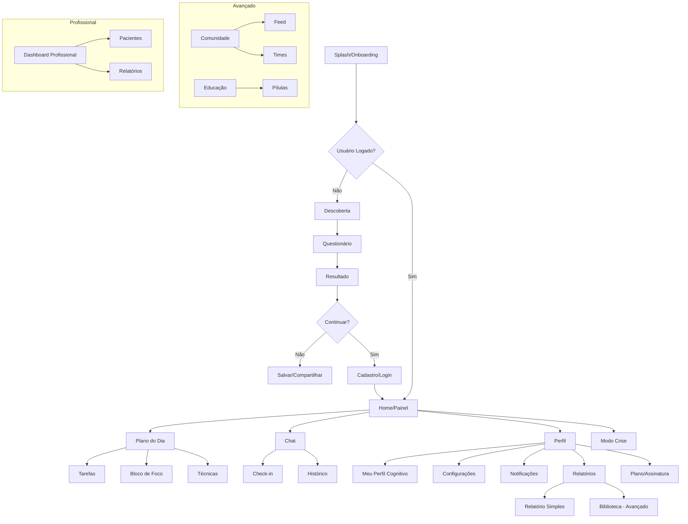
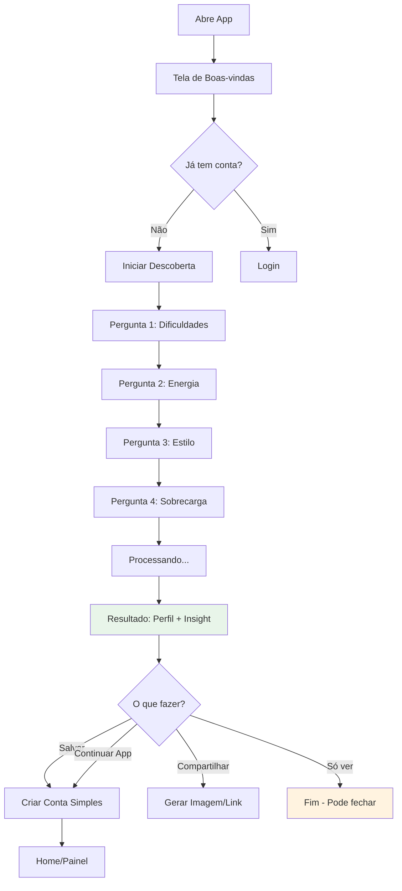
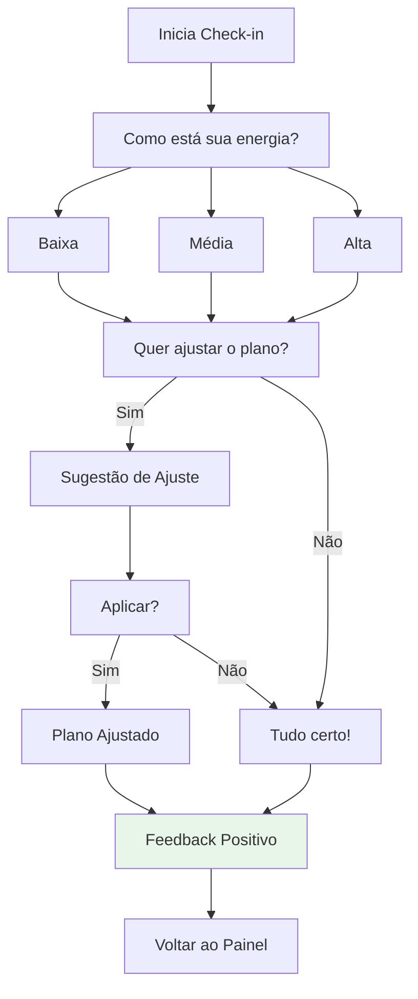
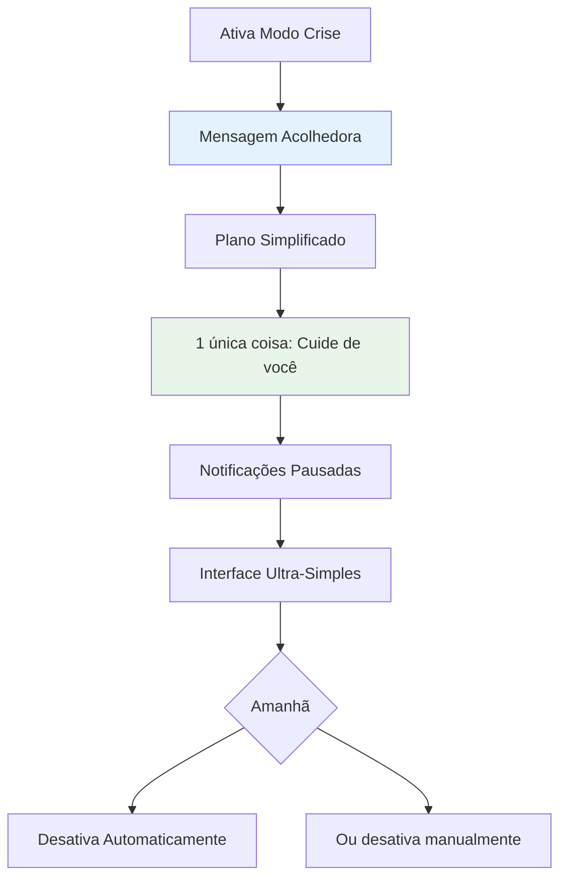
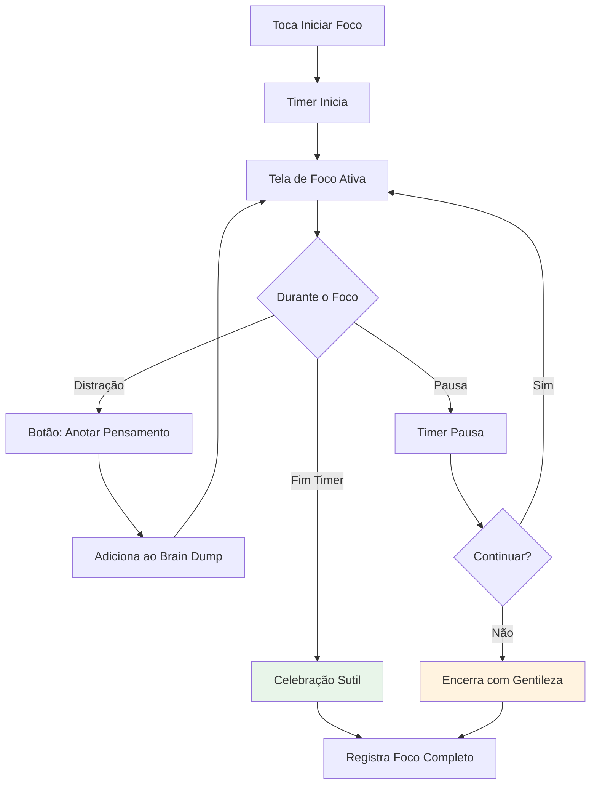

# NCIAFlux UI/UX Specification

**Versão:** 1.0
**Data:** 23 de Janeiro de 2026
**Status:** Draft

---

## 1. Introduction

Este documento define os objetivos de experiência do usuário, arquitetura de informação, fluxos de usuário e especificações de design visual para a interface do NCIAFlux. Serve como fundação para o design visual e desenvolvimento frontend, garantindo uma experiência coesa e centrada no usuário.

### 1.1 Overall UX Goals & Principles

#### Target User Personas

**Persona Primária: Ana, 32 anos - Profissional com TDAH**
- Diagnosticada há 2 anos, ainda aprendendo a lidar
- Trabalha remotamente, luta com foco e organização
- Já tentou vários apps de produtividade, todos abandonados
- Quer algo que a entenda, não que a cobre
- Frustrações: apps complexos, métricas punitivas, sobrecarga de features

**Persona Secundária: Carlos, 28 anos - Suspeita de TDAH**
- Não diagnosticado, mas se identifica com sintomas
- Curioso sobre como seu cérebro funciona
- Quer experimentar sem compromisso
- Busca clareza e autoconhecimento

**Persona Terciária: Dra. Marina - Psicóloga/Terapeuta**
- Atende pacientes com TDAH
- Quer ferramenta para acompanhar progresso
- Precisa de insights, não dados brutos
- Valoriza privacidade e ética

#### Usability Goals

| Meta | Critério de Sucesso |
|------|---------------------|
| **Facilidade de Aprendizado** | Novo usuário completa descoberta sem tutorial em < 7 min |
| **Eficiência** | Ações principais (check-in, iniciar foco) em máximo 3 toques |
| **Prevenção de Erros** | Nenhuma ação destrutiva sem confirmação; estados reversíveis |
| **Memorabilidade** | Usuário ausente por 1 semana retorna sem reaprender |
| **Satisfação** | Tom gentil em 100% das mensagens; zero linguagem punitiva |

#### Design Principles

1. **Calma sobre Produtividade** - O app deve transmitir tranquilidade, não urgência. Evitar contadores, streaks punitivos, ou qualquer elemento que gere ansiedade.

2. **Menos é Mais (Radical)** - Cada tela deve ter UM propósito claro. Remover tudo que não seja essencial. Espaço em branco é bem-vindo.

3. **Feedback Imediato e Gentil** - Toda ação tem resposta visual em < 300ms. Celebrar pequenas vitórias. Nunca mostrar "falha".

4. **Acessível por Padrão** - Considerar comorbidades (ASD, dislexia, ansiedade). Opções de reduzir animações. Contraste adequado.

5. **Progressivo, Não Invasivo** - Mostrar apenas o necessário. Features avançadas descobertas gradualmente. Nunca empurrar.

### 1.2 Change Log

| Data | Versão | Descrição | Autor |
|------|--------|-----------|-------|
| 2026-01-23 | 1.0 | Criação inicial | Sally (UX Expert) |

---

## 2. Information Architecture (IA)

### 2.1 Site Map / Screen Inventory



### 2.2 Navigation Structure

**Navegação Primária (Tab Bar - Mobile)**
```
[Home/Painel] [Plano] [Chat] [Perfil]
     🏠         📋      💬      👤
```

**Navegação Secundária**
- Menu dentro de Perfil para: Configurações, Notificações, Relatórios, Plano
- Acesso rápido a Modo Crise via long-press no ícone Home ou botão flutuante

**Breadcrumb Strategy**
- Não usar breadcrumbs (app mobile-first)
- Usar navegação por gestos (swipe back)
- Título da tela sempre visível no header

---

## 3. User Flows

### 3.1 Flow: Descoberta (Usuário Novo)

**User Goal:** Entender como meu cérebro funciona e receber insight prático

**Entry Points:**
- Abertura do app pela primeira vez
- Link compartilhado
- Landing page

**Success Criteria:**
- Completar questionário em < 7 minutos
- Ver perfil + insight + sugestão
- Sentir-se compreendido (não julgado)



**Edge Cases & Error Handling:**
- Perda de conexão durante questionário → Salvar respostas localmente, continuar offline
- App fechado no meio → Retomar de onde parou
- Usuário desiste → Permitir sair sem pressão, salvar progresso para retorno

**Notes:** A descoberta é o coração do produto. Deve ser impecável, fluida e emocionalmente positiva.

---

### 3.2 Flow: Check-in Diário

**User Goal:** Registrar como está meu dia de forma rápida e sem esforço

**Entry Points:**
- Notificação push
- Widget
- Botão no painel

**Success Criteria:**
- Completar em < 30 segundos
- Sentir que foi ouvido, não cobrado



**Edge Cases:**
- Usuário ignora notificação → Não enviar outra no mesmo dia
- Múltiplos check-ins → Mostrar último, permitir atualizar
- Energia muito baixa detectada → Sugerir Modo Crise gentilmente

---

### 3.3 Flow: Modo Crise

**User Goal:** Simplificar tudo quando estou sobrecarregado

**Entry Points:**
- Botão dedicado no painel
- Sugestão após check-in de energia baixa
- Long-press no ícone do app

**Success Criteria:**
- Ativar em 1 toque
- Sentir alívio imediato
- Saber que está tudo bem ter um dia difícil



---

### 3.4 Flow: Iniciar Bloco de Foco

**User Goal:** Começar um período de foco com apoio do app

**Entry Points:**
- Painel principal
- Widget
- Plano do dia



---

## 4. Wireframes & Key Screens

### 4.1 Primary Design Files

**Design Tool:** Figma (a ser criado)
**Link:** *Pendente criação*

### 4.2 Key Screen Layouts

#### Tela: Questionário de Descoberta

**Purpose:** Coletar informações do usuário de forma engajante e não-cansativa

**Key Elements:**
- Pergunta centralizada (texto grande, legível)
- Opções como cards tocáveis (não radio buttons)
- Barra de progresso sutil no topo
- Ilustração/ícone relacionado à pergunta
- Botão de voltar discreto

**Interaction Notes:**
- Swipe horizontal para navegar entre perguntas
- Toque em card seleciona e avança automaticamente
- Animação suave entre perguntas
- Haptic feedback ao selecionar

---

#### Tela: Resultado da Descoberta

**Purpose:** Entregar valor imediato e conexão emocional

**Key Elements:**
- Perfil resumido em destaque (card principal)
- Insight central em quote box estilizado
- Sugestão prática com ícone de "próximo passo"
- Botões: Salvar | Compartilhar | Continuar
- Ilustração celebratória sutil

**Interaction Notes:**
- Entrada com animação de "revelação"
- Insight pode ser destacado para compartilhamento
- Scroll suave se conteúdo exceder tela

---

#### Tela: Painel Principal (Home)

**Purpose:** Visão rápida do dia e acesso a ações principais

**Key Elements:**
- Saudação personalizada (hora + nome)
- Card de Prioridade do Dia (destaque)
- Indicador de Energia (visual, não número)
- Status do Foco (iniciado/não)
- Botão de Ajuste Rápido
- Acesso a Modo Crise (discreto mas acessível)

**Interaction Notes:**
- Pull-to-refresh atualiza plano
- Toque no card de prioridade expande detalhes
- Long-press em qualquer card mostra opções

---

#### Tela: Chat de Acompanhamento

**Purpose:** Interação conversacional leve para coleta de sinais

**Key Elements:**
- Bolhas de chat (sistema vs usuário)
- Quick replies como chips tocáveis
- Input de texto opcional (não obrigatório)
- Botão de voz (plano Avançado)
- Histórico rolável

**Interaction Notes:**
- Quick replies respondem em 1 toque
- Máximo 2-3 perguntas por sessão
- Tom sempre gentil e curto

---

#### Tela: Modo Crise

**Purpose:** Interface ultra-simplificada para dias difíceis

**Key Elements:**
- Fundo calmo (gradiente suave ou cor sólida)
- Mensagem acolhedora central
- UMA única sugestão simples
- Botão de desativar modo
- Sem navegação complexa visível

**Interaction Notes:**
- Tudo que não é essencial fica oculto
- Gestos funcionam para voltar
- Animações reduzidas automaticamente

---

## 5. Component Library / Design System

### 5.1 Design System Approach

**Abordagem:** Design System customizado com base em princípios de calma e acessibilidade. Não usar design systems "produtivos" como Material Design padrão - customizar para ser mais suave.

### 5.2 Core Components

#### Button

**Purpose:** Ações primárias e secundárias

**Variants:**
- Primary (ação principal)
- Secondary (ação secundária)
- Ghost (ação terciária/cancelar)
- Danger (ações destrutivas - uso mínimo)

**States:** Default, Hover, Pressed, Disabled, Loading

**Usage Guidelines:**
- Sempre com texto legível (mínimo 16px)
- Padding generoso (mínimo 12px vertical)
- Border-radius suave (8-12px)
- Nunca mais de 2 botões lado a lado

---

#### Card

**Purpose:** Containers de informação

**Variants:**
- Default (informação)
- Interactive (tocável)
- Highlight (destaque)
- Subtle (background)

**States:** Default, Hover, Pressed, Selected

**Usage Guidelines:**
- Sempre com padding interno consistente
- Sombra sutil para elevação
- Border-radius 12-16px
- Espaço adequado entre cards

---

#### Input

**Purpose:** Entrada de dados do usuário

**Variants:**
- Text (input simples)
- TextArea (texto longo)
- Select (escolha única)
- QuickReply (chips de resposta rápida)

**States:** Default, Focus, Filled, Error, Disabled

**Usage Guidelines:**
- Labels sempre visíveis (não apenas placeholder)
- Mensagens de erro gentis
- Auto-complete quando possível
- Tamanho de toque mínimo 44x44px

---

#### Progress

**Purpose:** Indicar progresso em processos

**Variants:**
- Bar (questionário)
- Circular (timer)
- Steps (onboarding)

**States:** Active, Complete, Pending

**Usage Guidelines:**
- Sempre mostrar onde o usuário está
- Cores positivas (nunca vermelho para incompleto)
- Animações suaves de transição

---

#### Toast/Feedback

**Purpose:** Feedback contextual não-intrusivo

**Variants:**
- Success (celebração)
- Info (informação)
- Gentle Warning (atenção suave)

**States:** Entering, Visible, Exiting

**Usage Guidelines:**
- Nunca bloquear interação
- Auto-dismiss após 3-4 segundos
- Posição consistente (bottom ou top)
- Sem "error" agressivo - reformular como "atenção"

---

## 6. Branding & Style Guide

### 6.1 Visual Identity

**Brand Guidelines:** Baseado nos assets em `doc/` - cérebro fluido com cores suaves

**Personalidade da Marca:**
- Acolhedora, não clínica
- Confiante, não urgente
- Gentil, não condescendente
- Moderna, não fria

### 6.2 Color Palette

| Tipo | Hex | Uso |
|------|-----|-----|
| **Primary** | `#4A90A4` | Ações principais, links, foco |
| **Primary Light** | `#7BB5C4` | Backgrounds de destaque |
| **Secondary** | `#E8A87C` | Acentos quentes, CTAs secundários |
| **Accent** | `#85C88A` | Sucesso, celebrações |
| **Background** | `#F9FAFB` | Fundo principal (light) |
| **Background Dark** | `#1A1D29` | Fundo principal (dark mode) |
| **Surface** | `#FFFFFF` | Cards, modais (light) |
| **Surface Dark** | `#252836` | Cards, modais (dark) |
| **Text Primary** | `#2D3748` | Texto principal |
| **Text Secondary** | `#718096` | Texto secundário |
| **Text Muted** | `#A0AEC0` | Texto desabilitado, hints |
| **Success** | `#68D391` | Feedback positivo |
| **Warning** | `#F6AD55` | Avisos gentis |
| **Energy Low** | `#FC8181` | Indicador energia baixa |
| **Energy Medium** | `#F6AD55` | Indicador energia média |
| **Energy High** | `#68D391` | Indicador energia alta |

### 6.3 Typography

#### Font Families

- **Primary:** Inter (corpo, UI)
- **Secondary:** Nunito (headings, destaque)
- **Monospace:** JetBrains Mono (código, se necessário)

#### Type Scale

| Elemento | Tamanho | Peso | Line Height |
|----------|---------|------|-------------|
| H1 | 32px | 700 | 1.2 |
| H2 | 24px | 600 | 1.3 |
| H3 | 20px | 600 | 1.4 |
| Body | 16px | 400 | 1.5 |
| Body Small | 14px | 400 | 1.5 |
| Caption | 12px | 400 | 1.4 |
| Button | 16px | 600 | 1.0 |

### 6.4 Iconography

**Icon Library:** Phosphor Icons (ou Heroicons)
- Estilo: Outline para UI, Filled para estados ativos
- Tamanho padrão: 24px
- Tamanho em botões: 20px
- Sempre com label acessível (aria-label)

### 6.5 Spacing & Layout

**Grid System:**
- Mobile: 4 colunas, 16px gutter, 16px margin
- Tablet: 8 colunas, 24px gutter, 24px margin
- Desktop: 12 colunas, 24px gutter, auto margin (max 1200px)

**Spacing Scale (baseado em 4px):**
```
xs:  4px
sm:  8px
md:  16px
lg:  24px
xl:  32px
2xl: 48px
3xl: 64px
```

---

## 7. Accessibility Requirements

### 7.1 Compliance Target

**Standard:** WCAG 2.1 AA

### 7.2 Key Requirements

**Visual:**
- Contraste mínimo 4.5:1 para texto normal, 3:1 para texto grande
- Focus indicators visíveis (outline 2px, offset 2px)
- Texto redimensionável até 200% sem perda de funcionalidade
- Não depender apenas de cor para transmitir informação

**Interaction:**
- Toda funcionalidade acessível via teclado
- Ordem de foco lógica e previsível
- Screen reader: labels descritivos, landmarks, live regions
- Touch targets mínimo 44x44px

**Content:**
- Alt text descritivo para imagens informativas
- Estrutura de headings hierárquica (H1 > H2 > H3)
- Labels explícitos para todos os campos de formulário
- Mensagens de erro associadas aos campos

**Considerações Especiais (TDAH/ASD):**
- Opção de reduzir movimento (prefers-reduced-motion)
- Evitar elementos piscando ou movendo constantemente
- Interfaces limpas sem sobrecarga sensorial
- Opção de modo de alto contraste

### 7.3 Testing Strategy

1. Testes automatizados (axe-core, Lighthouse)
2. Teste manual com VoiceOver (iOS) e TalkBack (Android)
3. Navegação apenas por teclado
4. Teste com zoom 200%
5. Validação com usuários reais neurodivergentes

---

## 8. Responsiveness Strategy

### 8.1 Breakpoints

| Breakpoint | Min Width | Max Width | Target |
|------------|-----------|-----------|--------|
| Mobile | 320px | 767px | Smartphones |
| Tablet | 768px | 1023px | Tablets, iPad |
| Desktop | 1024px | 1439px | Laptops, Desktop |
| Wide | 1440px | - | Monitores grandes |

### 8.2 Adaptation Patterns

**Layout Changes:**
- Mobile: Stack vertical, navegação bottom tab
- Tablet: 2 colunas onde apropriado, navegação lateral opcional
- Desktop: Layout mais espaçoso, sidebar para navegação

**Navigation Changes:**
- Mobile: Bottom tab bar (4 itens)
- Tablet: Bottom tab ou sidebar colapsável
- Desktop: Sidebar fixa ou top nav

**Content Priority:**
- Mobile: Prioridade do dia em destaque, features secundárias abaixo
- Tablet/Desktop: Dashboard com widgets lado a lado

**Interaction Changes:**
- Mobile: Touch, swipe, haptics
- Desktop: Hover states, keyboard shortcuts

---

## 9. Animation & Micro-interactions

### 9.1 Motion Principles

1. **Propósito** - Toda animação deve ter razão de existir (feedback, orientação, deleite)
2. **Sutileza** - Preferir animações curtas e suaves
3. **Performance** - Usar transform e opacity (GPU-accelerated)
4. **Respeito** - Honrar prefers-reduced-motion

### 9.2 Key Animations

| Animação | Descrição | Duração | Easing |
|----------|-----------|---------|--------|
| **Page Transition** | Fade + slide sutil | 200ms | ease-out |
| **Card Press** | Scale down 0.98 | 100ms | ease-in-out |
| **Button Press** | Scale down 0.95 + haptic | 100ms | ease-in-out |
| **Toast Enter** | Slide up + fade in | 250ms | ease-out |
| **Toast Exit** | Fade out | 200ms | ease-in |
| **Success Celebration** | Confetti sutil / pulse | 600ms | spring |
| **Progress Fill** | Width animate | 300ms | ease-out |
| **Focus Timer Tick** | Pulse sutil a cada minuto | 200ms | ease-in-out |
| **Check Complete** | Scale bounce + checkmark draw | 400ms | spring |

---

## 10. Performance Considerations

### 10.1 Performance Goals

| Métrica | Meta |
|---------|------|
| **First Contentful Paint** | < 1.5s |
| **Time to Interactive** | < 3s |
| **Interaction Response** | < 100ms |
| **Animation FPS** | 60fps (mínimo 30fps) |
| **Bundle Size (mobile)** | < 2MB inicial |

### 10.2 Design Strategies

- **Lazy loading** de imagens e componentes não-críticos
- **Skeleton screens** durante carregamento (não spinners)
- **Otimização de imagens** (WebP, tamanhos responsivos)
- **Animações com transform/opacity** apenas
- **Virtualização** para listas longas
- **Offline-first** com cache agressivo de assets estáticos

---

## 11. Next Steps

### 11.1 Immediate Actions

1. Criar projeto no Figma com Design System base
2. Prototipar fluxo de Descoberta (alta prioridade)
3. Prototipar Painel Principal
4. Validar com 3-5 usuários do público-alvo
5. Iterar baseado em feedback
6. Handoff para desenvolvimento

### 11.2 Design Handoff Checklist

- [x] Todos os fluxos de usuário documentados
- [x] Inventário de componentes completo
- [x] Requisitos de acessibilidade definidos
- [x] Estratégia responsiva clara
- [x] Guidelines de marca incorporados
- [x] Metas de performance estabelecidas
- [ ] Protótipos de alta fidelidade no Figma
- [ ] Testes de usabilidade realizados

---

## 12. Checklist Results

*A ser preenchido após execução do checklist UX*

---

*Documento gerado seguindo BMad Method v4.44.3*
